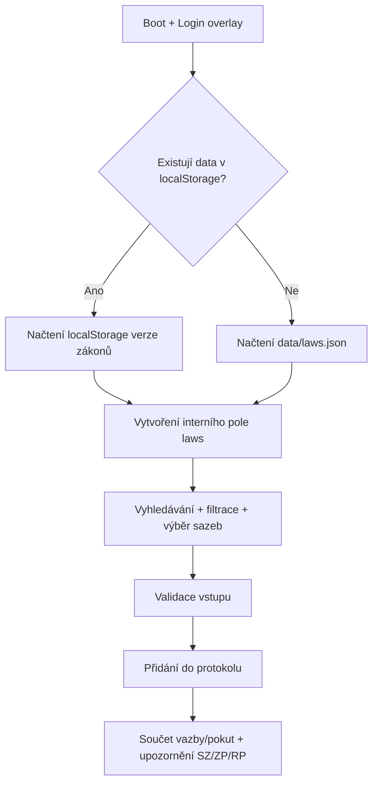

# SASP Penal Code Terminal

Webová aplikace pro práci s trestním zákoníkem (MDT styl) pro SASP.
Slouží k rychlému vyhledání paragrafů, výběru konkrétní sazby a sestavení protokolu případu se součtem vazby/pokut a upozorněními na procesní podmínky.

---

## Obsah

- [Přehled](#přehled)
- [Rychlý start](#rychlý-start)
- [Workflow aplikace](#workflow-aplikace)
- [Datový model laws.json](#datový-model-lawsjson)
- [Vysvětlení minJ / maxJ / isLife](#vysvětlení-minj--maxj--islife)
- [Validace při přidání do protokolu](#validace-při-přidání-do-protokolu)
- [Ukládání a správa dat](#ukládání-a-správa-dat)
- [Export a import dat](#export-a-import-dat)
- [Struktura repozitáře](#struktura-repozitáře)

---

## Přehled

### Co aplikace dělá

- Načte trestní zákoník ze souboru `data/laws.json`.
- Umožňuje filtrování podle kategorií a fulltextové hledání.
- U každé sub-položky paragrafu umožní zadat délku vazby a/nebo pokutu podle pravidel dané sazby.
- Při přidání do protokolu provádí validace (minimum/maximum sazby, povinná data).
- Upozorňuje na procesní podmínky:
  - povinnost odebrat ZP / RP,
  - nutnost přítomnosti státního zástupce (trest nad 20 let nebo doživotí).
- Umožňuje export/import aktuálních dat zákonů v JSON.
- Ukládá úpravy zákonů do `localStorage` (přednostně před původním JSON).

### Technický stack

| Oblast | Použití |
|---|---|
| Frontend | HTML + CSS + Vanilla JavaScript |
| Persistenční vrstva | `localStorage` |
| Zdroj dat zákonů | `data/laws.json` |
| Provoz | statická webová aplikace |

---

## Rychlý start

### Varianta A: jednoduché spuštění

```bash
npx serve .
```

Potom otevřete URL, kterou server vypíše (typicky `http://localhost:3000`).

### Varianta B: Python HTTP server

```bash
python -m http.server 3000
```

Potom otevřete `http://localhost:3000`.

> Doporučení: používejte HTTP server, protože aplikace načítá JSON přes `fetch`.

---

## Workflow aplikace



---

## Datový model laws.json

### Ukázka struktury

```json
{
  "version": "2026.1",
  "categories": [
    {
      "id": "persons",
      "name": "Trestné činy proti osobám",
      "icon": "⚔️",
      "laws": [
        {
          "id": "par7",
          "number": 7,
          "title": "§7 Ublížení na zdraví",
          "description": "...",
          "subs": [
            {
              "label": "a)",
              "text": "...",
              "minJ": 1,
              "maxJ": 5,
              "isLife": false,
              "hasJ": true,
              "hasF": false,
              "fixedFine": null,
              "fixedJail": null,
              "removeZP": false,
              "removeRP": false
            }
          ]
        }
      ]
    }
  ]
}
```

### Root objekt

| Pole | Typ | Význam |
|---|---|---|
| `version` | `string` | Verze datového balíku zákonů |
| `categories` | `array` | Seznam kategorií |

### Kategorie

| Pole | Typ | Význam |
|---|---|---|
| `id` | `string` | Strojový identifikátor kategorie (např. `persons`, `traffic`) |
| `name` | `string` | Název kategorie pro UI |
| `icon` | `string` | Ikona používaná v UI/adminu |
| `laws` | `array` | Seznam paragrafů v kategorii |

### Paragraf (`law`)

| Pole | Typ | Význam |
|---|---|---|
| `id` | `string` | Unikátní identifikátor paragrafu (např. `par37`) |
| `number` | `number` | Číselné označení paragrafu |
| `title` | `string` | Název paragrafu |
| `description` | `string` | Doplňující text pod hlavičkou |
| `subs` | `array` | Varianty sazeb daného paragrafu |

### Sub-položka (`sub`)

| Pole | Typ | Význam |
|---|---|---|
| `label` | `string` | Označení varianty (`a)`, `b)`, `-`) |
| `text` | `string` | Právní/popisný text varianty |
| `minJ` | `number` | Minimální vazba v letech |
| `maxJ` | `number` | Maximální vazba v letech |
| `isLife` | `boolean` | Varianta obsahuje/doznačuje doživotí |
| `hasJ` | `boolean` | Varianta má vazbu (aktivní vstup LET) |
| `hasF` | `boolean` | Varianta má pokutu (aktivní vstup $) |
| `fixedFine` | `number \| null` | Fixní pokuta, pokud je daná přesně |
| `fixedJail` | `number \| null` | Fixní vazba, pokud je daná přesně |
| `removeZP` | `boolean` | Nutnost odebrání zbrojního průkazu |
| `removeRP` | `boolean` | Nutnost odebrání řidičského průkazu |

---

## Vysvětlení minJ / maxJ / isLife

### Základní pravidla

- `minJ` a `maxJ` se používají pouze pokud `hasJ = true`.
- `minJ = 0` a `maxJ = 0` typicky znamená přestupek bez vazby.
- `maxJ = 99` se používá jako hraniční hodnota u sazeb s možností doživotí.
- `isLife = true` zapíná režim doživotí v UI i souhrnu protokolu.

### Praktické mapování textu zákona do dat

| Text sazby | minJ | maxJ | isLife | hasJ |
|---|---:|---:|---:|---:|
| odnětím svobody od 1 do 5 let | 1 | 5 | false | true |
| pokutou do 5 000 $ | 0 | 0 | false | false |
| odnětím svobody od 25 let po doživotí | 25 | 99 | true | true |
| odnětím svobody na doživotí | 0 | 99 | true | true |

---

## Validace při přidání do protokolu

Při kliknutí na `+` aplikace provádí následující kontroly:

| Kontrola | Podmínka | Výsledek |
|---|---|---|
| Podminimální trest | `hasJ && !isLife && minJ > 0 && jVal < minJ` | Zablokování přidání + hláška |
| Nadmaximální trest | `hasJ && maxJ > 0 && maxJ < 99 && jVal > maxJ` | Zablokování přidání + hláška |
| Chybějící vazba | `hasJ && !isLife && jVal === 0 && !fixedJail` | Zablokování přidání + hláška |
| Povinné odebrání dokladů | `removeZP || removeRP` | Potvrzovací dialog |
| Přítomnost SZ | `isLife || jVal > 20` | Potvrzovací dialog |

```js
// Zjednodušený rozhodovací model
if (sub.hasJ && !sub.isLife && jail < sub.minJ) reject();
if (sub.hasJ && sub.maxJ > 0 && sub.maxJ < 99 && jail > sub.maxJ) reject();
if (sub.hasJ && !sub.isLife && jail === 0 && !sub.fixedJail) reject();

if (sub.removeZP || sub.removeRP) confirmDocumentRemoval();
if (sub.isLife || jail > 20) confirmStateAttorneyPresence();

commitToProtocol();
```

---

## Ukládání a správa dat

### Priorita zdrojů

1. `localStorage` (`sasp_laws_v3`) pokud existuje.
2. Jinak soubor `data/laws.json`.

### Admin funkce

- Editace zákonů a sub-položek.
- Export aktuálního JSON.
- Import JSON.
- Reset na výchozí data ze souboru.

---

## Export a import dat

### Exportovaný formát

```json
{
  "version": "2026.1",
  "categories": [
    "..."
  ]
}
```

### Poznámky k importu

- Aplikace akceptuje oba tvary:
  - objekt s klíčem `categories`,
  - nebo přímo pole kategorií.
- Po úspěšném importu se data uloží do `localStorage`.

---

## Struktura repozitáře

```text
.
├─ index.html
├─ README.md
├─ css/
│  └─ style.css
├─ data/
│  └─ laws.json
├─ js/
│  └─ app.js
├─ test/
└─ tresty.html
```

| Soubor | Účel |
|---|---|
| `index.html` | Hlavní stránka aplikace |
| `js/app.js` | Logika aplikace (načítání dat, validace, protokol, admin) |
| `data/laws.json` | Zdroj právních dat |
| `css/style.css` | Vizuální styl aplikace |

